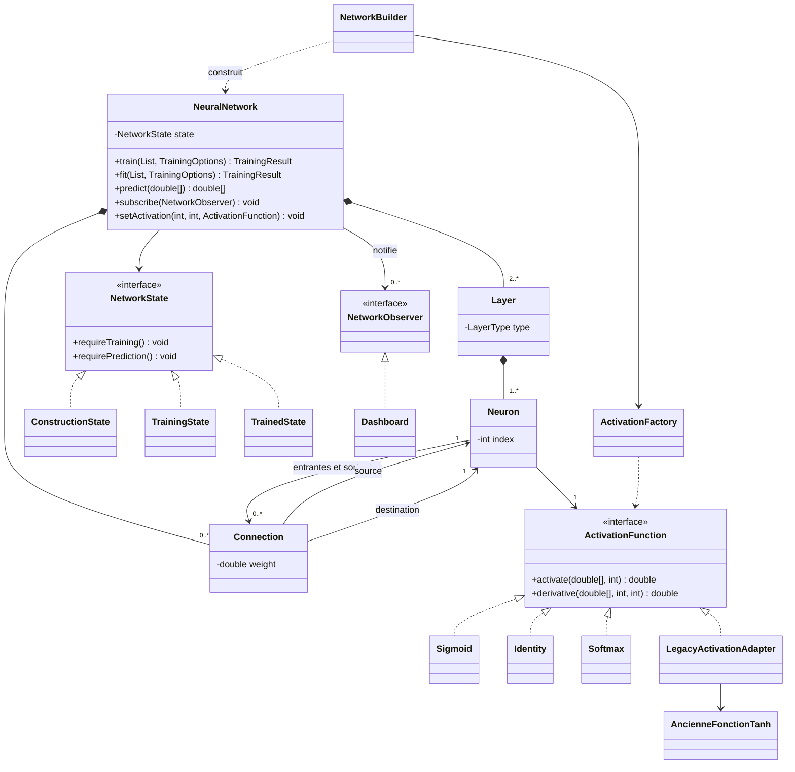
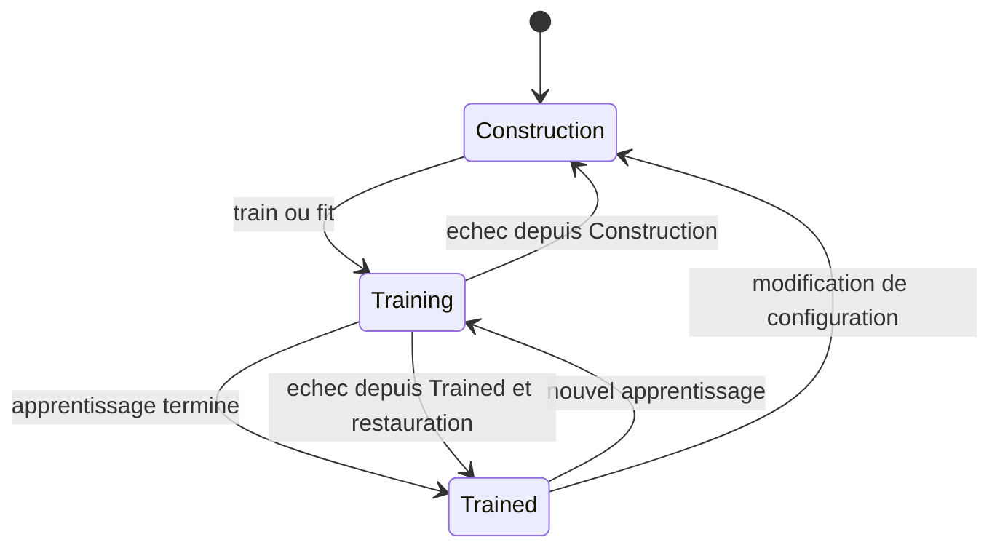

# Diagrammes UML

Les PNG du rapport sont générés à partir de la même conception ; Mermaid fournit ici une version textuelle lisible sur GitHub.

```mermaid
classDiagram
    class NeuralNetwork {
        -NetworkState state
        +train(List, TrainingOptions) TrainingResult
        +fit(List, TrainingOptions) TrainingResult
        +predict(double[]) double[]
        +subscribe(NetworkObserver) void
        +setActivation(int, int, ActivationFunction) void
    }
    class Layer { -LayerType type }
    class Neuron { -int index }
    class Connection { -double weight }
    class ActivationFunction {
        <<interface>>
        +activate(double[], int) double
        +derivative(double[], int, int) double
    }
    class Sigmoid
    class Identity
    class Softmax
    class LegacyActivationAdapter
    class AncienneFonctionTanh
    class NetworkState {
        <<interface>>
        +requireTraining() void
        +requirePrediction() void
    }
    class ConstructionState
    class TrainingState
    class TrainedState
    class NetworkObserver { <<interface>> }
    class Dashboard
    class NetworkBuilder
    class ActivationFactory
    NeuralNetwork *-- "2..*" Layer
    NeuralNetwork *-- "0..*" Connection
    Layer *-- "1..*" Neuron
    Neuron --> "1" ActivationFunction
    Neuron --> "0..*" Connection : entrantes et sortantes
    Connection --> "1" Neuron : source
    Connection --> "1" Neuron : destination
    ActivationFunction <|.. Sigmoid
    ActivationFunction <|.. Identity
    ActivationFunction <|.. Softmax
    ActivationFunction <|.. LegacyActivationAdapter
    LegacyActivationAdapter --> AncienneFonctionTanh
    NeuralNetwork --> NetworkState
    NetworkState <|.. ConstructionState
    NetworkState <|.. TrainingState
    NetworkState <|.. TrainedState
    NeuralNetwork --> "0..*" NetworkObserver : notifie
    NetworkObserver <|.. Dashboard
    NetworkBuilder ..> NeuralNetwork : construit
    NetworkBuilder --> ActivationFactory
    ActivationFactory ..> ActivationFunction
```

```mermaid
stateDiagram-v2
    [*] --> Construction
    Construction --> Training : train ou fit
    Training --> Trained : apprentissage termine
    Training --> Construction : echec depuis Construction
    Trained --> Training : nouvel apprentissage
    Training --> Trained : echec depuis Trained et restauration
    Trained --> Construction : modification de configuration
```
